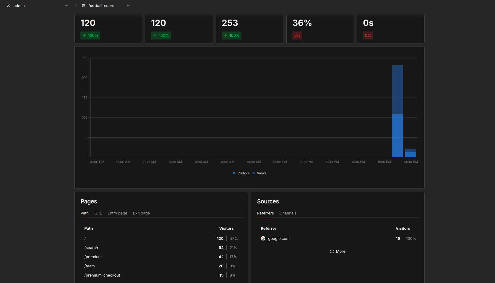
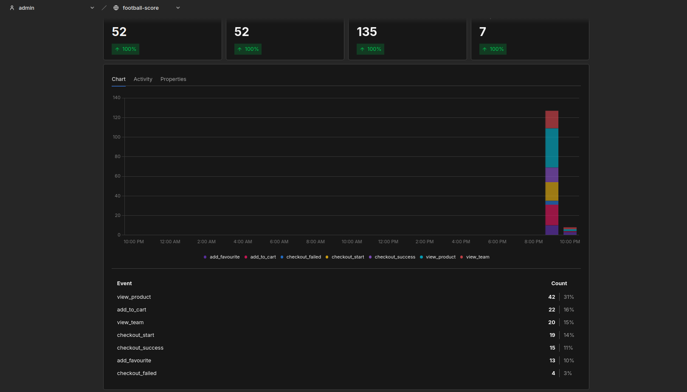
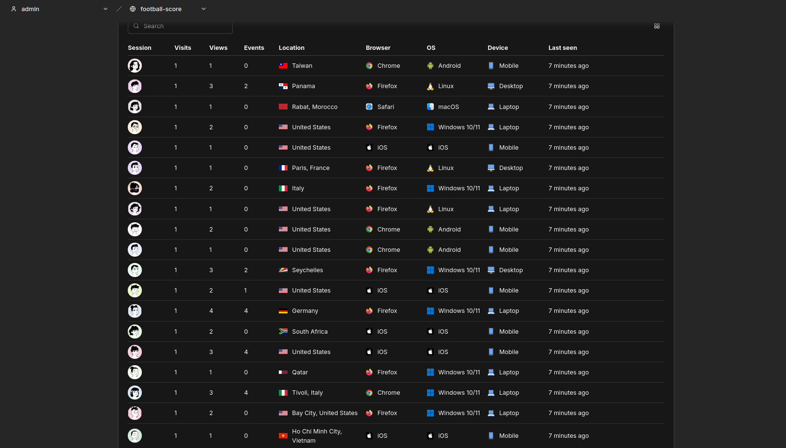
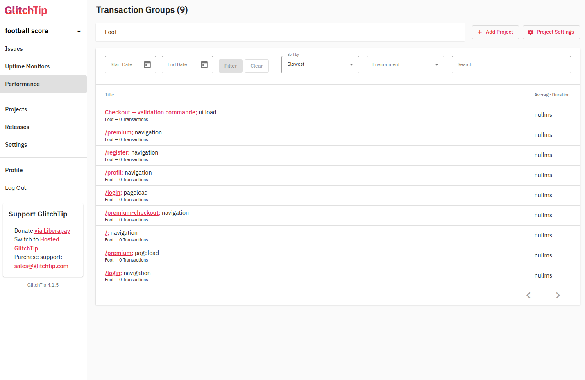
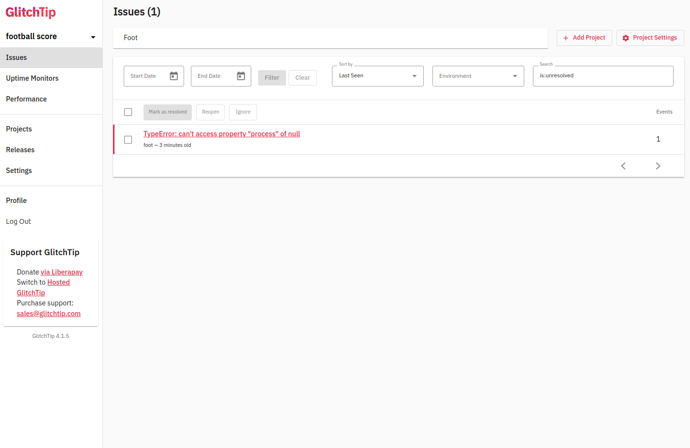

# Rapport d'observabilité — Football-Score

> Stack : Nuxt 4 + nginx + **Umami** (analytique sans cookies) + **GlitchTip** (erreurs & performance), le tout orchestré par Docker Compose.
>
> Les données analysées ci-dessous proviennent de **2 × 40 visiteurs simulés le 31/07/2026** via `node scripts/simulate-traffic.mjs --visitors 40`, complétés par des parcours manuels dans l'application.
>
> ⚠️ Pour les captures : filtrer le dashboard Umami sur la **journée du 31/07/2026**. La base contient aussi d'anciens événements de test (05/07) émis par une version antérieure du plan de marquage, incohérents avec le tunnel actuel.

## 1. Trafic global (Umami)

| Métrique | Valeur observée (31/07/2026) |
|---|---|
| Visites (sessions uniques) | **80** |
| Pages vues | **167** |
| Taux de rebond (page d'accueil) | **≈ 36 %** |
| Durée moyenne de session | **≈ 1 s** (parcours simulés, cf. remarque) |

### Analyse du taux de rebond

Le taux de rebond mesure la part de visiteurs qui repartent après avoir vu **une seule page** (ici la page d'accueil, qui liste les matchs du jour). Nous observons un rebond d'environ **36 %**, une valeur saine pour un site de contenu : la page d'accueil répond déjà à la question « quels sont les scores du jour ? », un départ immédiat n'est donc pas forcément un échec.

Un taux de rebond qui grimperait au-delà de 50–60 % serait en revanche un signal d'alerte : page trop lente (à recouper avec les mesures de performance GlitchTip, §4), contenu non pertinent par rapport à la campagne d'acquisition (à recouper avec `utm_source`, §3), ou erreur JS bloquante (à recouper avec GlitchTip, §5).

> Remarque : les sessions simulées par script durent quelques secondes (les « temps de réflexion » entre pages sont de 0,3 à 0,9 s). La durée moyenne de session observée est donc plus courte que celle d'utilisateurs réels — c'est une limite assumée de la simulation.

## 2. Tunnel d'achat (événements personnalisés)

Le tunnel suit l'achat de l'abonnement **Premium (4,99 €)** en 4 étapes :

| Étape | Événement | Nombre | % de l'étape précédente | Taux d'abandon |
|---|---|---|---|---|
| 1 | `view_product` | **30** | — | — |
| 2 | `add_to_cart` | **15** | 50 % | **50 %** |
| 3 | `checkout_start` | **14** | 93 % | 7 % |
| 4 | `checkout_success` | **10** | 71 % | 29 % |

**Taux de conversion global** = `checkout_success / visites totales` = 10 / 80 = **12,5 %**.

### Analyse du tunnel

- **L'étape la plus « fuyante »** est le passage `view_product → add_to_cart` (**50 % d'abandon**) : c'est le moment où le visiteur découvre le prix. Leviers classiques : essai gratuit, mise en avant de la résiliation sans engagement (déjà présente sur la page), preuve sociale.
- L'abandon entre `add_to_cart` et `checkout_start` (**7 %**) est marginal car le passage est direct (un seul clic, pas de création de compte supplémentaire ni de formulaire).
- L'écart entre `checkout_start` et `checkout_success` combine en théorie deux causes qu'il faut séparer : l'abandon volontaire et **les échecs de paiement**. C'est précisément pour cela que l'événement `checkout_failed` a été ajouté — et il est décisif ici : les 4 paiements non aboutis correspondent **tous** à un `checkout_failed` (14 = 10 succès + 4 échecs). L'abandon de la dernière étape est donc **100 % technique** (la passerelle défaillante du §5), pas commercial : corriger le bug rapporterait mécaniquement ~29 % de conversions en plus sur cette étape.
- Le **panier moyen** est porté par la propriété `amount` de `checkout_success` (ici constant à 4,99 € puisqu'il n'y a qu'un produit, mais le mécanisme est en place pour un catalogue multi-produits).

## 3. Origine du trafic

La simulation injecte du trafic direct, du référencement (`google.com`) et trois campagnes : `utm_source=newsletter`, `utm_source=instagram_ads` et `ref=partner-blog`. Umami les ventile nativement (onglet *Sources / UTM*), ce qui permet de comparer le **taux de conversion par canal** : un canal qui amène beaucoup de visites mais peu de `checkout_success` (typique des publicités mal ciblées) est un budget à réallouer.

## 4. Suivi de performance (GlitchTip)

Le composable `useGlitchTip().measureLoadTime()` mesure le temps de chargement des composants clés — notamment la **page de validation de commande** (`/premium-checkout`) et le dashboard — et l'envoie à GlitchTip sous forme de transactions (`op: ui.load`), en plus des transactions `pageload`/`navigation` automatiques du SDK (`browserTracingIntegration`, `tracesSampleRate: 1.0`).

Croiser ces durées avec le tunnel permet de vérifier une hypothèse fréquente : *« les utilisateurs abandonnent au paiement parce que la page est lente »*. Si la transaction « Checkout — validation commande » reste sous quelques centaines de millisecondes, la lenteur est hors de cause et l'abandon s'explique autrement.

## 5. Erreur simulée au paiement (GlitchTip)

Le bouton « Confirmer et payer » échoue volontairement **1 fois sur 3** : la « passerelle de paiement » est `null` et l'appel `gateway.process(499)` lève un `TypeError`, capturé et envoyé à GlitchTip.

### Comment un développeur résout ce bug grâce à GlitchTip

La fiche d'événement GlitchTip fournit tout le contexte nécessaire, **sans avoir besoin de reproduire le bug à l'aveugle** :

1. **Le message et le type** — `TypeError: Cannot read properties of null (reading 'process')` — indiquent immédiatement qu'un objet attendu est `null` au moment de l'appel.
2. **La stacktrace** pointe le fichier, la fonction et la ligne exacts (`processPaymentGateway` dans `premium-checkout.vue`) : on sait *où* regarder sans fouiller le code.
3. **Les tags OS / navigateur** permettent de vérifier si l'erreur touche tous les environnements (bug de logique, notre cas) ou un seul navigateur (bug de compatibilité).
4. **Les breadcrumbs** retracent le parcours de l'utilisateur avant le crash (navigation vers `/premium-checkout`, clic sur le bouton, requêtes réseau) : on peut rejouer le scénario exact.
5. **La fréquence** (nombre d'occurrences, nombre d'utilisateurs touchés) permet de prioriser : ici ~1 paiement sur 3, donc priorité maximale — c'est de la perte de chiffre d'affaires directe, mesurable en croisant avec les `checkout_failed` d'Umami.

Correctif type : s'assurer que la passerelle est initialisée avant l'appel (`if (!gateway) throw new PaymentUnavailableError()` + retry/message utilisateur), ajouter un test sur ce chemin, puis vérifier dans GlitchTip que l'issue ne réapparaît plus après déploiement (fonction *Resolve* de l'issue).

## 6. Respect du RGPD

- **Umami** : pas de cookies, pas de consentement requis, IP non stockées en clair.
- **GlitchTip** : `beforeSend` supprime `email` et `ip_address` de chaque événement ; `sendDefaultPii` reste désactivé.
- **Plan de marquage** : aucune propriété d'événement ne contient de PII (uniquement des identifiants techniques, montants et noms d'équipes publics).
- **Logs serveur** : les erreurs sont loggées sans données utilisateur.
