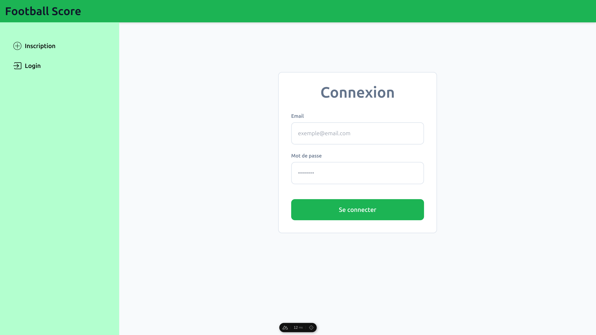
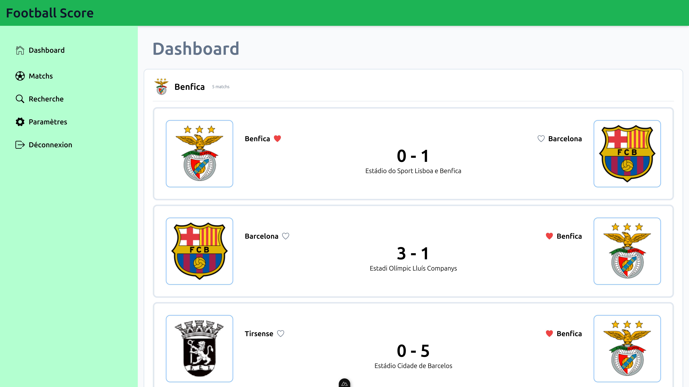
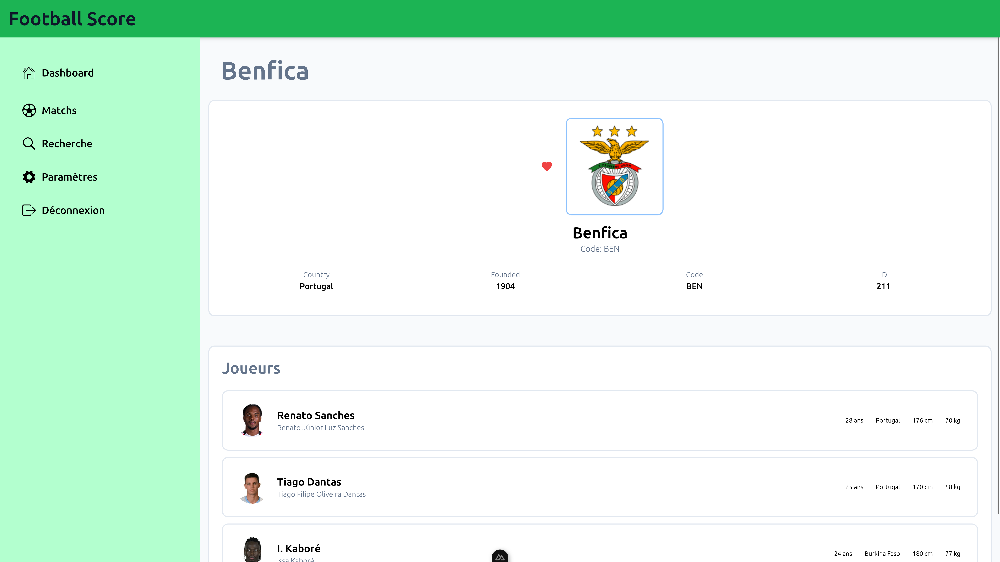
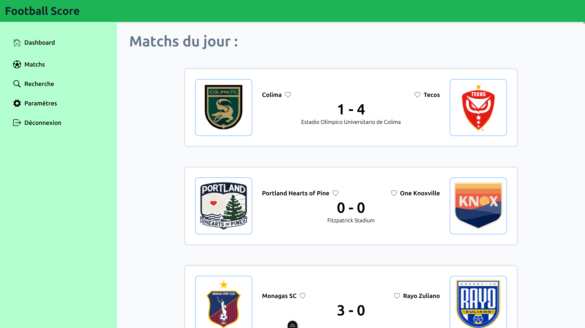
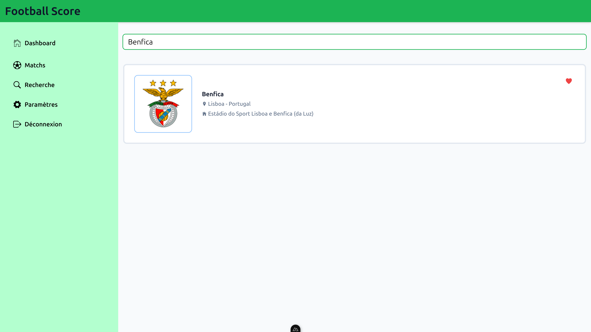
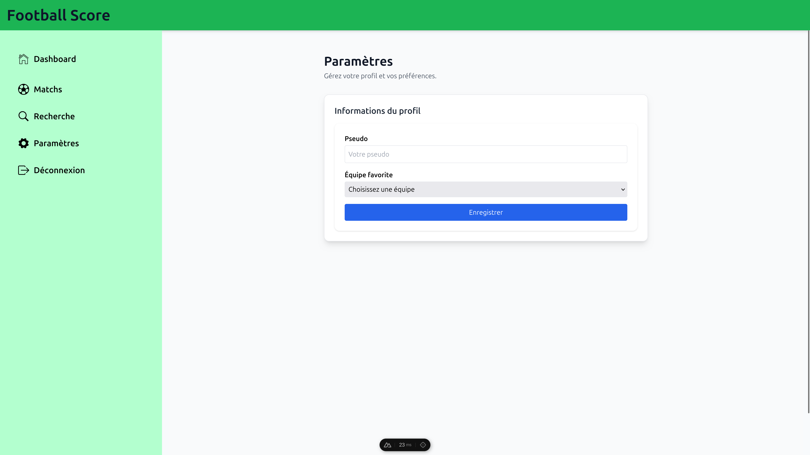

# Installation
- Extraire le dossier zippé
- Se déplacer dans le dossier extrait
- Lancer le daemon de Docker ou lancer Docker Desktop
- Lancer le projet en développement avec : `docker compose up -d --build`

# Explication du projet
Une application de football réalisée en Nuxt 4, qui exploite l'API de api-football.com, réalisé par Vincent, Oliver et William, qui utilise de nombreux concepts de Nuxt.

# Fonctionnalités
- **Authentification** : Inclut une page d'inscription, de connexion et une fonctionnalité de déconnexion qui utilise Nuxt Auth, avec un lien en base de données avec Drizzle et Postgre, deplus un middleware qui vérifie si l'utilisateur est connecté.
- **Dashboard** : Une page `dashboard.vue` permettant de voir les cinqs prochains matchs des équipes favorites, et permet une redirection vers la page de détail de l'équipe quand on appuie sur le logo d'une équipe.
- **Détail d'une équipe** : Une page `team.vue` qui permet voir des données sur une équipe précise, et sur ses joueurs.
- **Liste des matchs du jour** : Une page `index.vue` qui regroupe tous les matchs du jours dans l'ordre croissant avec des données dynamique en fonction du match (score, temps de jeu actuel, heure du match à venir), cette page permet aussi la redirection vers le détail d'une équipe.
- **Rechercher un club** : Une page `search.vue` qui permet de rechercher un club par son nom (ex: Benfica), et qui permet aussi d'ajouter le club dans ses favoris (Pinia) et de le retrouver dans le `dashboard`.
- **Paramètres** : Une page `settings.vue` qui permet de renseigner son nom d'utilisateur et de retrouver ses clubs mis en favoris (Pinia), et qui vérifie si le nom d'utilisateur comporte plus de 3 caractères, ainsi qu'une équipe est sélectionnée quand on appuie sur le bouton.
- **Déconnexion** : Une fonctionnalité de déconnexion basique.

# Captures d'écran
- **Authentification** :
    - 
- **Dashboard** :
    - 
- **Détail d'une équipe** : 
    - 
- **Liste des matchs du jour** : 
    - 
- **Rechercher un club*** : 
    - 
- **Paramètres** :
    - 

# Limites / Améliorations possibles
- Amélioration de la page paramètre pour faire une vrai sauvegarde du pseudo et clubs favoris via Pinia.
- Amélioration de la page de liste des matchs du jour pour permettre un filtrage au niveau des ligues ou de l'état du match (finit, en cours, pas commencé).